## 训练效果如何

## 神经网络(更改)

### 1. 神经元（感知机）

一个神经网络有若干神经元组成，要想理解神经网络就要先理解一个神经元的工作。

  

每一个神经元会从轴突中接受其他神经元的信号，将这些信号经过处理后，会从轴突中输出给其他神经元。

  

以图中一个神经元的工作的工作过程为例：

该神经元的左侧有3个输入$x_1,x_2,x_3$，对应三个权重$w_1,w_2,w_3$ 。我们会计算$w_1*x_1+w_2*x_2+w_3*x_3$ 即权重和输入值的乘积值和，然后与偏置值b相加。这个乘积的累加和经过==一个非线性的激活函数==，得到一个输出。上述过程可以用以下公式表达：

​											$ h_{w,b}(x)=f(w^T*x+b)$

**w、x**分别表示向量，f是一个非线性的激活函数。

### 2. 单层神经网络

  

多个神经元连接在一起可以构成一层神经网络，如图所示，这个单层神经网络由三个神经元构成。三个神经网络进行并行计算。每个神经元$a_i$都完成了$a_i = f(\sum_{j=1}^3{w_{i,j}*x_j + b_i)} $ 的运算（$w_{1,2}$即为$x_2$到神经元$a_1$的权重值）。

此时所有的权重值可以用一个矩阵$W$表示表示，运算过程如下图所示：

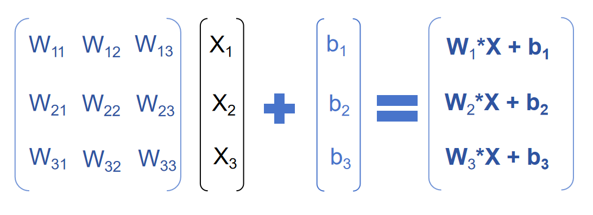

对生成的向量中的每一个值都经过激活函数f，组成一个新的向量$a=f(W*x+b)$,$(W表示矩阵，b、x表示向量)$

### 3.多层神经网络

 

在单层神经网络的基础上我们可以叠加多层，组成更为复杂的多层神经网络，我们将最后一层称为==输出层==，将输入部分称为==输入层==，输入之上成为==隐藏层==，如图中所示上一层的输出作为下一层的输入我们称之为==前向传播==

​											$h_1 = f(W_1*x+b_1)$

​											$h_2=f(W_2*h_1+b_2)$

​											$h_3=f(W_3*h_2+b_3)$

$W_i表示矩阵、b_i、h_i、x表示向量$


基于以上对神经网络的理解，我们希望做一个全连接神经网络完成分类任务。 

 全连接神经网络是一种多层的感知机结构。**每一层的每一个节点都与上下层节点全部连接**，这就是”全连接“的由来。整个全连接神经网络分为输入层，隐藏层和输出层，其中**隐藏层**可以更好的**分离数据的特征**，但是过多的隐藏层会**导致过拟合问题**。 (https://blog.csdn.net/ShiningLeeJ/article/details/126676581)

## 任务说明

### 1. 问题

​	通过全连接神经网络完成对时尚物品的多分类任务，物品有10中类别如表中所示

| Label | Description    |
|-------|----------------|
| 0     | T恤（T-shirt/top）|
| 1     |  裤子（Trouser）              |
| 2     |   套头衫（Pullover）             |
| 3     |   连衣裙（Dress）             |
| 4     |   外套（Coat）             |
| 5     |   凉鞋（Sandal）             |
| 6     |    衬衫（Shirt）            |
| 7     |    运动鞋（Sneaker）            |
| 8     |    包（Bag）            |
| 9     |     靴子（Ankle boot）           |

### 2. 创建全连接神经网络

```python
class Classifier(nn.Module):
    def __init__(self):
        super().__init__()
        self.fc1 = nn.Linear(784, 256)
        self.fc2 = nn.Linear(256, 128)
        self.fc3 = nn.Linear(128, 64)
        self.fc4 = nn.Linear(64, 10)

        # 构造Dropout方法，在每次训练过程中都随机“掐死”百分之二十的神经元，防止过拟合。
        self.dropout = nn.Dropout(p=0.2)

    def forward(self, x):
        # 确保输入的tensor是展开的单列数据，把每张图片的通道、长度、宽度三个维度都压缩为一列
        x = x.view(x.shape[0], -1)

        # 在训练过程中对隐含层神经元的正向推断使用Dropout方法
        x = self.dropout(F.relu(self.fc1(x)))
        x = self.dropout(F.relu(self.fc2(x)))
        x = self.dropout(F.relu(self.fc3(x)))

        # 在输出单元不需要使用Dropout方法
        x = F.log_softmax(self.fc4(x), dim=1)

        return x
```

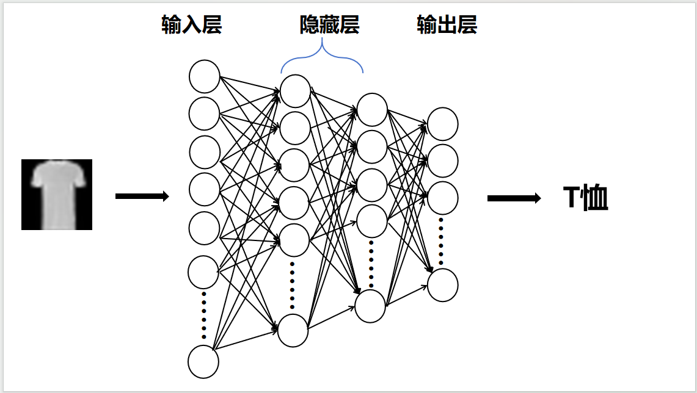

具体来说，我们设计了一个四层神经网络。这个神经网络会以数字图像作为输入，经过神经网络的计算识别出图像中物品的类别

 `forward` 方法定义了数据在网络中的前向传播过程，即从输入到输出的计算流程。具体来说，它描述了如何将输入数据逐步传递给每一层，并应用相应的激活函数和其他操作（如Dropout）。 

### 3. 数据集

训练神经网络采用的数据集为Fashion-MNIST数据集，首先对该数据集进行简单的介绍：

Fashion-MNIST是Zalando商品图片的数据集，包含60,000个训练样本和10,000个测试样本。每个样本是一个28x28像素的灰度图像，与10个类别中的一个标签关联。用于基准测试机器学习算法。它具有相同的图像大小以及训练和测试分割的结构。

>  严肃地说，我们正在讨论替代MNIST。以下是一些很好的理由：
> • MNIST太简单了。卷积网络可以在MNIST上达到99.7％。经典的机器学习算法也可以轻松地达到97％。查看我们的Fashion-MNIST与MNIST并排基准测试，并阅读“大多数MNIST数字对可以通过仅一个像素很好地区分开。”
> • MNIST被过度使用了。在2017年4月的这个Twitter帖子中，谷歌大脑研究科学家和深度学习专家Ian Goodfellow呼吁人们远离MNIST。
> • MNIST不能代表现代计算机视觉任务，正如2017年4月这个Twitter帖子中，深度学习专家/Keras作者François Chollet所指出的那样。 


### 3. 神经网络对图像的处理过程

要想训练神经网络我们需要明确输入的图像数据的大小和格式，我们使用的是28×28像素的灰度图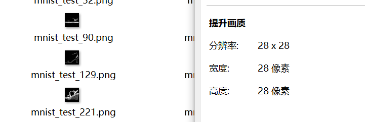


首先我们将单通道的28×28像素大小的灰度图展平为一个1×784维的向量。

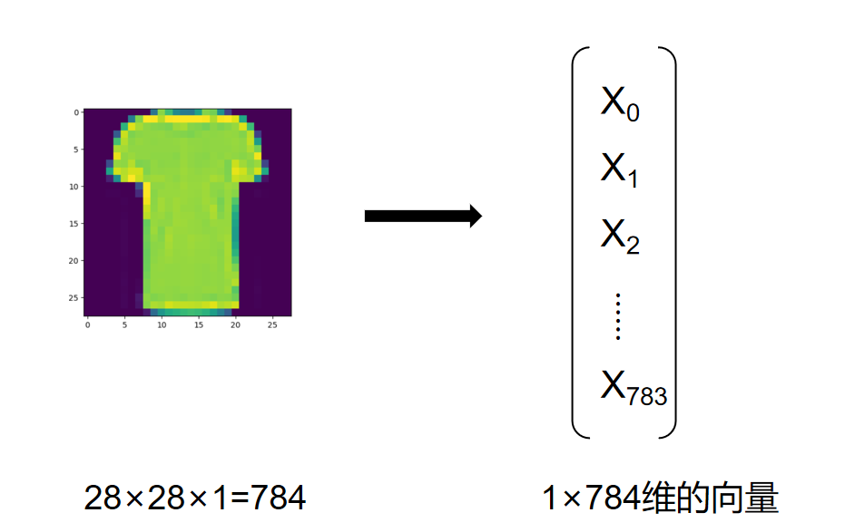


将处理得到向量给到输入层，输入层的每一个神经元都会接受一个向量$x$一个维度的数据，因此输入层拥有784个神经元。 784个像素值代表了图像中每个像素的灰度信息，是最低级别的特征。 

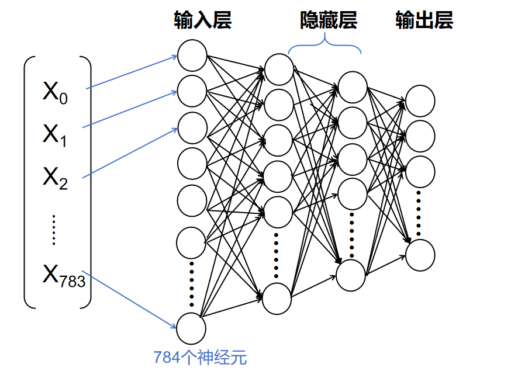

隐藏层的主要作用是对输入数据进行变换，通过==组合低级特征形成更高级的抽象==表示。 

> 我们首先明确的一点就是：
>
> 每个神经元都与前一层的所有神经元相连。这意味着每个神经元接收到的信息是整个输入图像或数据的全局信息，而不是局部区域的信息。 全连接神经网络的学习过程更像是对输入数据进行一种全局变换，而不是专注于捕捉特定位置的局部模式或结构。 

全连接神经网络并没有像卷积神经网络那样明确的特征提取的设计，那么全连接神经网络是如何学习到图像中的特征的呢？接下来将逐层进行具体的阐述：（也是对“组合低级特征形成更高级的抽象”这句话的具体阐述）

**输入层**

 784个像素值代表了图像中每个像素的灰度信息，是最低级别的特征。 

**第一隐藏层（fc1）**

 当输入数据进入第一个全连接层时，该层通过一个线性变换（矩阵乘法加偏置）将784维输入映射到一个新的256维空间。

 然后应用ReLU激活函数引入非线性。此时，虽然每个神经元接收到的信息是整个输入的全局信息，但是通过学习适当的权重，==某些神经元可能会对特定模式敏感，如某些方向上的边缘或线条。这是由于如果某些像素组合对于正确分类特别重要，相应的权重会被调整得更大==。**（这一过程在训练过程中具体阐述如何对特定模式敏感）**

> 解释为什么要用激活函数引入非线性：
>
> 神经网络本质上是通过一系列的线性变换（如矩阵乘法）来处理输入数据。然而，仅靠线性变换，无论网络有多深，其表达能力仍然有限，只能表示线性决策边界。如图：
>
> 
>
> 引入非线性，使得网络能够捕捉到输入数据中的复杂关系，从而实现对非线性问题的有效建模。 

**第二、三隐藏层（fc2、fc3）**

随着数据传递到更深的层次，每一层都在前一层的基础上进一步抽象化。例如，在第二隐藏层，基于第一层学到的简单模式，它可能开始识别稍微复杂的形状。

这些形状是由多个低级特征组合而成的。即使全连接层不专门针对局部结构进行操作，通过多层的非线性变换，网络仍然能够捕捉到不同部分之间的关系，并逐步构建出更加复杂和抽象的特征表示。

**输出层（fc4）**


### 4. 训练神经网络

#### 4.1 加载数据集，并对数据集中的图片进行转换

```python
from torchvision import datasets, transforms
transform = transforms.Compose([
    transforms.ToTensor(),
    transforms.Normalize((0.5,), (0.5,))
])

# 下载Fashion-MNIST训练集数据，并构建训练集数据载入器trainloader
trainset = datasets.FashionMNIST('dataset/', download=True, train=True, transform=transform)
trainloader = torch.utils.data.DataLoader(trainset, batch_size=200, shuffle=True)

# 下载Fashion-MNIST测试集数据，并构建测试集数据载入器testloader
testset = datasets.FashionMNIST('dataset/', download=True, train=False, transform=transform)
testloader = torch.utils.data.DataLoader(testset, batch_size=200, shuffle=True)
```

- 讲解一下数据变换`transforms.Compose`:

  `transforms.ToTensor():` 将PIL图像转换为`torch.Tensor`对象，并且会将图像中的像素值自动==归一化==到[0,1]的范围内。原本我们的数据集中的图片的像素值范围在[0,255]范围内。

  `transforms.Normalize((0.5,), (0.5,)):`  这个变换对张量进行标准化处理，使得每个通道的均值变为 0.5，标准差变为 0.5 。这个变换会将输入张量中的值减去 0.5，然后除以 0.5，结果就是==将tensor中的值从 [0, 1] 范围映射到 [-1, 1] 范围==。

  

  ​									$ output = \frac{(input - mean) }{std}   \\ mean=0.5, std=0.5$

  

> 讲解这一变换过程很重要，因为经过这样处理过的数据都会在[-1,1]的范围内，与激活函数ReLu相结合就能解释上面我们遗留的问题，隐藏层是如何对特定的模式敏感。
>
> > 在上面我们定义的神经网络中，在forward方法中我们定义了在每一层经过线性变换后得到的输出（一个1*n维度的tensor）经过激活函数ReLu计算后，将计算得到的值作为输入传递给下一层。这里的ReLu激活函数为$f(x) = max(0,x)$：
> >
> > 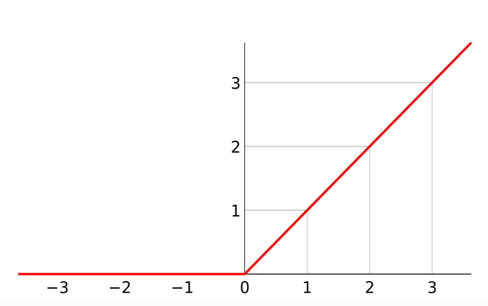
> >
> > 而在神经网络中，ReLU函数作为神经元的激活函数，为神经元在线性变换$w^Tx+b$ 之后的非线性变换，换言之，对于进入神经元的来自上一层神经网络的输入向量$x$，使用ReLU函数的神经元会输出$max(0,w^T+b)$
> >
> > 图片来源：https://blog.csdn.net/weixin_41929524/article/details/112253138
>
> - ReLU 将所有负输入设为零，这种稀疏性有助于减少模型复杂度，并可能提高泛化能力。它可以帮助网络忽略不重要的特征，专注于那些对分类或回归任务有意义的信息。我们通过这个激活函数实现了对特定模式敏感，从而实现对分类有意义的特征的学习。
>
> 有了对激活函数的概念，我们可以解决第二个遗留问题：神经网络是如何做出最终的分类决策的?
>
> 
>
> 在输出层的激活函数我们更改为log_softmax()函数：
>
> 在输出层经过线性变换会输出10个值，对应着10个物品类别。 通过log_softmax()函数输出层的10个值就映射成为(0,1)的值，而这些值的累和为1（满足概率的性质），那么我们将它理解成概率，选取概率最大（也就是值对应最大的）节点，作为我们的预测目标类别。    

#### 4.2 定义损失函数和优化器

```python
# 定义损失函数为负对数损失函数，并移动到GPU
criterion = nn.NLLLoss().to(DEVICE)

# 优化方法为Adam梯度下降方法，学习率为0.001
optimizer = optim.Adam(model.parameters(), lr=0.002)
```

-  `nn.NLLLoss()` 是 PyTorch 中提供的一个损失函数，用于计算负对数似然（Negative Log Likelihood, NLL）损失 。它通常与 log_softmax 激活函数结合使用，特别是在多分类任务中。
  - 负对数似然损失衡量的是模型预测的概率分布与真实标签之间的差异。具体来说，对于每个样本，它会计算正确类别的对数概率，并取其负值作为损失。损失越小，表示模型的预测越接近真实标签。

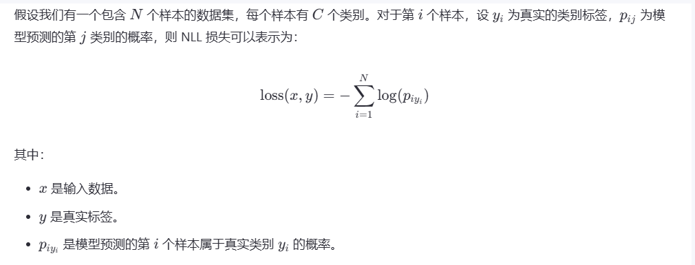

> **我们为什么不是用多分类任务中更为常用的交叉熵损失函数？**
>
> CrossEntropyLoss 实际上结合了两个步骤：
>
> - Log Softmax：将模型输出转换为对数概率分布。
> - NLLLoss：计算负对数似然损失。
>
> 由于我们已经在输出层的激活函数中定义了log_softmax()因此为避免重复计算使用负对数似然损失函数
>
> 
>
> **利用损失函数，我们希望完成什么任务？**
>
> 损失函数作为反馈信号，用于调整模型的参数（如权重和偏置），以最小化损失值。这是通过反向传播算法实现的，该算法根据损失函数的梯度更新参数用以找到最小损失。 


#### 4.3 开始训练

```python
print('开始训练')
for e in range(epochs):
    running_loss = 0
    
    # 对训练集中的所有图片都过一遍
    for images, labels in trainloader:
        # 将优化器中的求导结果都设为0，否则会在每次反向传播之后叠加之前的
        optimizer.zero_grad()
        
        # 对64张图片进行推断，计算损失函数，反向传播优化权重，将损失求和
        log_ps = model(images)
        loss = criterion(log_ps, labels)
        #反向传播
        loss.backward()
        #更新模型参数
        optimizer.step()
        running_loss += loss.item()
    
    # 每次学完一遍数据集，都进行以下测试操作
    else:
        test_loss = 0
        accuracy = 0
        # 测试的时候不需要开自动求导和反向传播
        with torch.no_grad():
            # 关闭Dropout
            model.eval()
            
            # 对测试集中的所有图片都过一遍
            for images, labels in testloader:
                # 对传入的测试集图片进行正向推断、计算损失，accuracy为测试集一万张图片中模型预测正确率
                log_ps = model(images)
                test_loss += criterion(log_ps, labels)
                ps = torch.exp(log_ps)
                top_p, top_class = ps.topk(1, dim=1)
                equals = top_class == labels.view(*top_class.shape)
                
                # 等号右边为每一批64张测试图片中预测正确的占比
                accuracy += torch.mean(equals.type(torch.FloatTensor))
        # 恢复Dropout
        model.train()
        # 将训练误差和测试误差存在两个列表里，后面绘制误差变化折线图用
        train_losses.append(running_loss/len(trainloader))
        test_losses.append(test_loss/len(testloader))

        print("训练集学习次数: {}/{}.. ".format(e+1, epochs),
              "训练误差: {:.3f}.. ".format(running_loss/len(trainloader)),
              "测试误差: {:.3f}.. ".format(test_loss/len(testloader)),
              "模型分类准确率: {:.3f}".format(accuracy/len(testloader)))
```

- 模型训练过程：加载数据集-设计模型-定义损失函数-反向传播-更新参数-模型评估
- **反向传播**其实就是在计算梯度，利用链式法则，从输出层开始逐层向前计算并累积梯度信息，直到到达输入层。
- 优化器：根据计算出的梯度更新模型参数，以最小化损失函数

#### 4.4 使用Dropout防止过拟合问题

​     如果没有使用Dropout可以看到，虽然训练误差一直在下降，但测试误差居高不下，并没有很好的泛化能力。

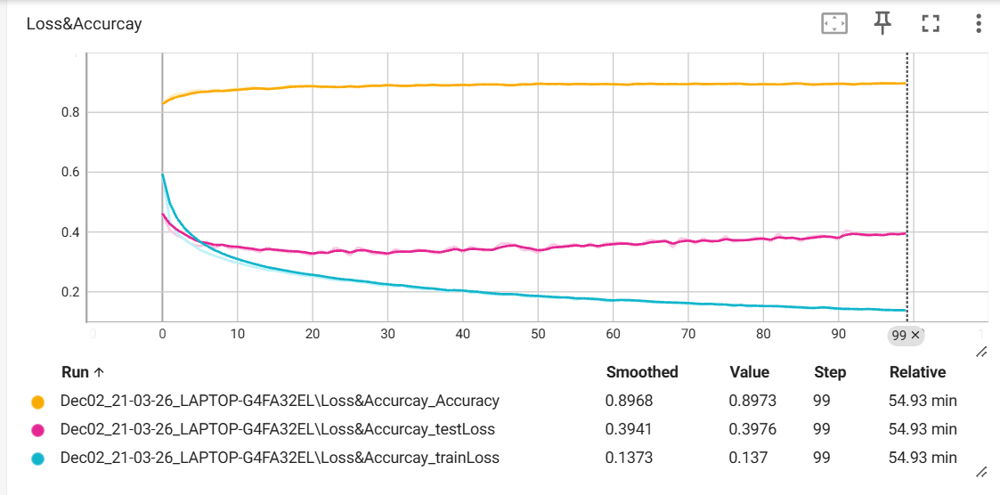

 我们可以采用Dropout的方法，也就是在每次正向推断训练神经元的时候随机“掐死”一部分神经元，阻断其输入输出，这样可以起到正则化的作用。      


介绍使用的工具pytorch 


1. 介绍使用的工具pytorch 

   

   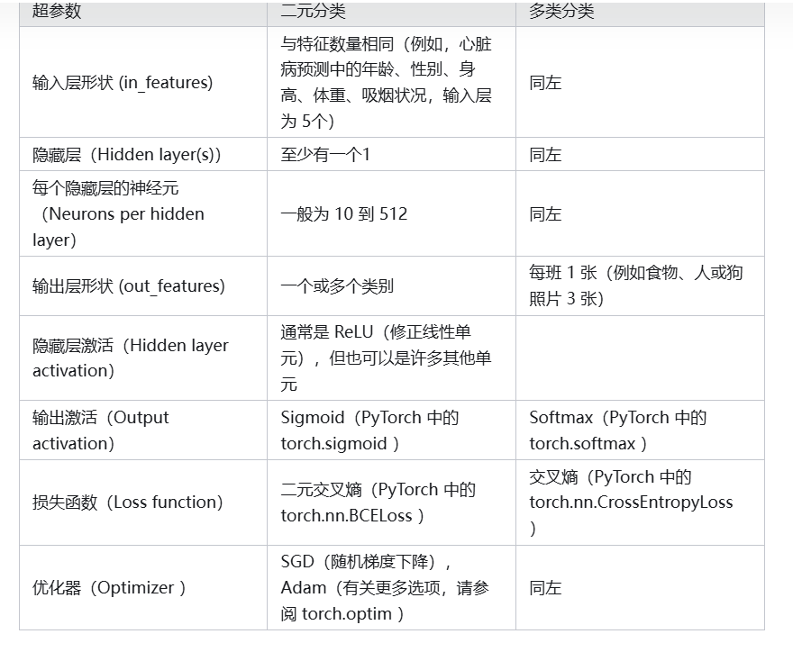

   介绍神经网络采用这个表格中的内容进行介绍

   采用什么样的激活函数，为什么要采用这样的激活函数（ReLu函数作为激活函数）

   **定义损失函数和优化器**

   我们需要一个损失函数来度量预测的效果。 不同的问题类型需要不同的损失函数。例如，对于回归问题（预测数字），您可能会使用平均绝对误差 (MAE) 损失。对于二元分类问题（例如我们的问题），您通常会使用**二元交叉熵**作为损失函数。

   > *交叉熵损失*：所有标签分布与预期间的损失值。

   然而，相同的优化器函数通常可以在不同的问题空间中使用。例如，随机梯度下降优化器（SGD， `torch.optim.SGD()` ）可用于解决一系列问题，这同样适用于 Adam 优化器（ `torch.optim.Adam()` ）。

   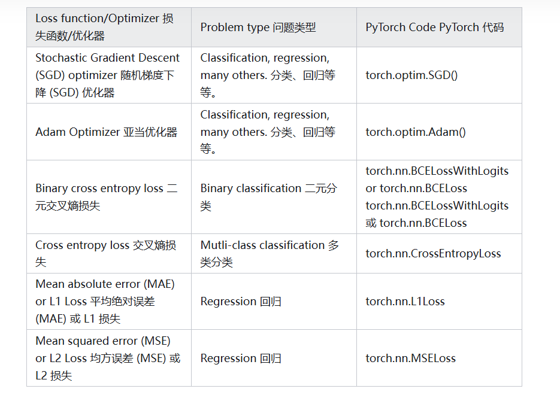

   

   2. 设立评估指标（准确率）

      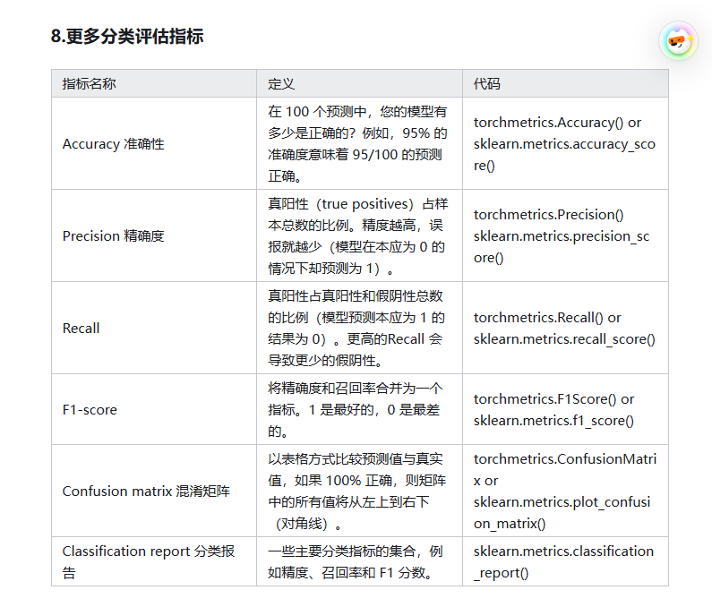

   

>  在实验过程中，通过调整学习率，和增加训练次数等手段都不能使模型的正确率突破90%，我们可以通过增加模型层数提高准确率么？
>
> 答案是否定的,由于全连接模型的每个神经元都与下一层的所有神经元有连接，因此该模型本身所需的参数量巨大，再继续增加层数容易出现过拟合现象反而得到的结果不好，这说明已进达到了该模型的准确率极限。可以考虑使用卷积神经网络等更优秀的网络完成分类任务。


| 模型改进技术          | 它有什么作用？                                               |
| --------------------- | ------------------------------------------------------------ |
| 添加更多层            | 每一层都可能增加模型的学习能力，每层都能够学习数据中的某种新模式，更多层通常被称为使神经网络更深。 |
| 添加更多隐藏单位      | 与上面类似，每层更多的隐藏单元意味着模型学习能力的潜在增加，更多的隐藏单元通常被称为使你的神经网络更宽。 |
| 训练更多此more epochs | 如果您的模型有更多机会查看数据，它可能会了解更多信息。       |
| 更改激活函数          | 有些数据不能只用直线拟合（就像我们所看到的那样），使用非线性激活函数可以帮助解决这个问题。 |
| 改变学习率            | 模型特定性较少，但仍然相关，优化器的学习率决定模型每一步应改变其参数的程度，太多，模型会过度校正，太少，则学习得不够。 |
| 改变损失函数          | 同样，虽然模型不太具体，但仍然很重要，不同的问题需要不同的损失函数。例如，二元交叉熵损失函数不适用于多类分类问题。 |
| 使用迁移学习          | 从与您的问题域类似的问题域中获取预训练模型，并将其调整为您自己的问题。我们在06-PyTorch迁移学习：在预训练模型上进行训练中介绍了迁移学习。 |

【参考资料】

[使用PyTorch进行深度学习](https://www.zhihu.com/column/c_1696566817139687424) https://www.zhihu.com/column/c_1696566817139687424

[神经网络基础原理（二）----分类问题（含Tensorflow 2.X代码)]()https://blog.csdn.net/uniqueleion/article/details/114370715

[ 【子豪兄Pytorch】二十分钟搭建神经网络分类Fashion-MNIST数据集时尚物品 ](https://www.bilibili.com/video/BV1w4411u7ay/?spm_id_from=333.337.search-card.all.click&vd_source=9f478deb3625b9abe5f16c27a6295eea)

[ Github：zihaopytorch ](https://github.com/zalandoresearch/fashion-mnist/blob/master/README.zh-CN.md)

[既然使用神经网络也可以解决分类问题，那SVM、决策树这些算法还有什么意义呢？](https://www.zhihu.com/question/331029209)

[数据集fashion-MIST](https://github.com/zalandoresearch/fashion-mnist/tree/master)

https://blog.csdn.net/m0_61878383/article/details/136552258

[PyTorch | 保存和加载模型](https://zhuanlan.zhihu.com/p/82038049)

https://blog.csdn.net/si_ying/article/details/138463143?ops_request_misc=%257B%2522request%255Fid%2522%253A%2522b61af2f73d9e89f5aec1355eaece788e%2522%252C%2522scm%2522%253A%252220140713.130102334..%2522%257D&request_id=b61af2f73d9e89f5aec1355eaece788e&biz_id=0&utm_medium=distribute.pc_search_result.none-task-blog-2~all~top_positive~default-5-138463143-null-null.142^v100^pc_search_result_base8&utm_term=%E7%A5%9E%E7%BB%8F%E7%BD%91%E7%BB%9C&spm=1018.2226.3001.4187

